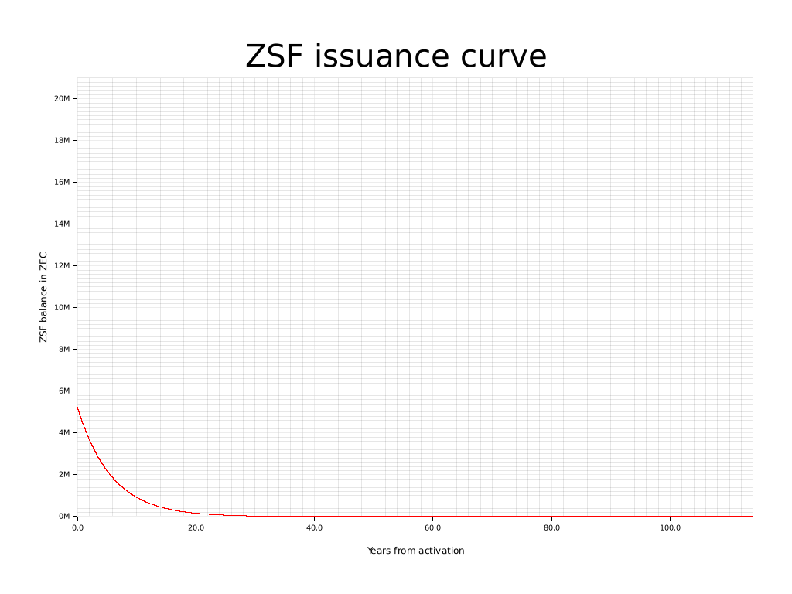
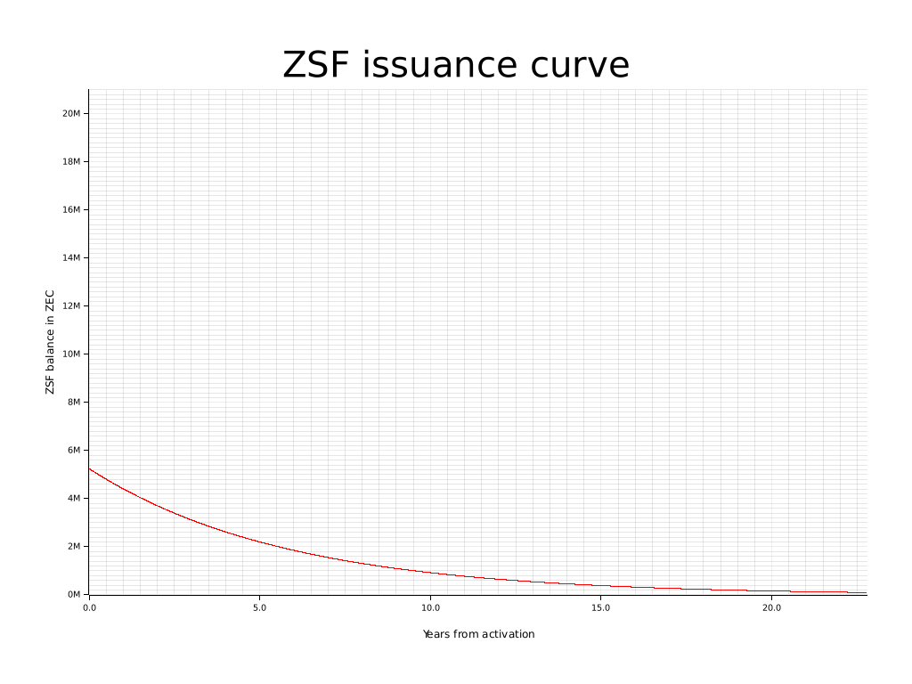

# Zcash Sustainaiblity Fund simulator

This short Rust program simulates Zcash Block Rewards (aka Block Subsidies) assuming Zcash Sustainability Fund backed smoothing out of the issuance curve will be implemented (https://github.com/zcash/zips/pull/706).

## Running

### Devenv
You can use [devenv.sh](https://devenv.sh/) to setup a development environment. Otherwise follow the instructions below.

### Manual setup

To run the program, you need to have Rust installed. You'll also need some extra libraries to enable plotting, on Ubuntu do:

```
sudo apt install pkg-config libfreetype6-dev libfontconfig1-dev
```

 Then, clone this repository and run:

```
cargo run
```

## Output

The program's last line of output will be the following:

```
Block 47917869 (~113.88 years): Subsidy: 1 (~0 ZEC), ZSF: 0 (~0 ZEC)
```

The program will also output PNG files with plots of the issuance curve in `plots/`:



