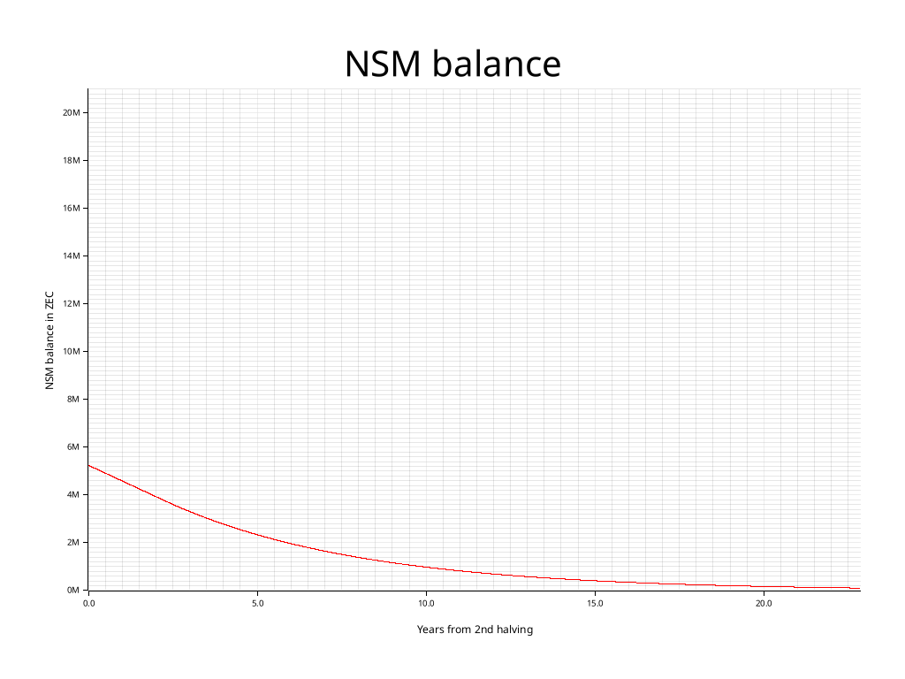
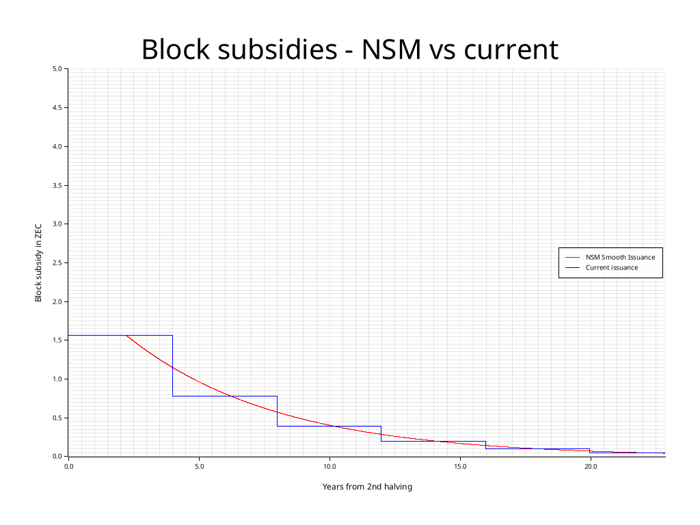

# Network Sustainability Mechanism simulator

This short Rust program simulates Zcash Block Subsidies, assuming that smoothing of the
issuance curve in line with the Network Sustainability Mechanism will be implemented as
specified in [ZIP 234](https://zips.z.cash/zip-0234).

## Running

### Manual setup

To run the program, you need to have Rust installed. You'll also need some extra libraries
to enable plotting, on Ubuntu do:

```
sudo apt install pkg-config libfreetype6-dev libfontconfig1-dev
```

Then, clone this repository and run:

```
cargo run
```

## Disclaimer

This fork of Eiger's "[ZSF simulator](https://github.com/eigerco/zsf-simulator)" has been
significantly modified by me, Daira-Emma Hopwood. Any errors in the interpretation of
ZIP 234 are my own.

## Output

The program will output the final block that subsidies would be paid out from
according to ZIP 234:

```
DEPLOYMENT_BLOCK_HEIGHT = 3662980 (2.23 years after 2nd halving)
Last block with non-zero subsidy is at height 50788958 in ~114.23 years after the 2nd halving.
Final block subsidy: 1 (~0.00000001 ZEC)
Final NSM balance: 0 (~0 ZEC)
```

It also gives a summary of subsidies that would be paid out during 4-year periods
after NSM deployment in comparison with the current issuance scheme. (Note that
these periods do not line up with halving periods under the current scheme.)

```
Four-year periods:
Years   0..  4 at heights  3662980.. 5342980:
  NSM subsidies:    189352008318309 (~ 1893520.083 ZEC,   1.12709529 ZEC per block)
  no-NSM subsidies: 189329765625000 (~ 1893297.656 ZEC,   1.12696289 ZEC per block)
  difference:           22242693309 (~     222.427 ZEC),         NSM/no-NSM: 1.0001
Years   4..  8 at heights  5342980.. 7022980:
  NSM subsidies:     94673941416154 (~  946739.414 ZEC,   0.56353537 ZEC per block)
  no-NSM subsidies:  94664804687500 (~  946648.047 ZEC,   0.56348098 ZEC per block)
  difference:            9136728654 (~      91.367 ZEC),         NSM/no-NSM: 1.0001
Years   8.. 12 at heights  7022980.. 8702980:
  NSM subsidies:     47335978420161 (~  473359.784 ZEC,   0.28176178 ZEC per block)
  no-NSM subsidies:  47332402343750 (~  473324.023 ZEC,   0.28174049 ZEC per block)
  difference:            3576076411 (~      35.761 ZEC),         NSM/no-NSM: 1.0001
Years  12.. 16 at heights  8702980..10382980:
  NSM subsidies:     23667493076937 (~  236674.931 ZEC,   0.14087793 ZEC per block)
  no-NSM subsidies:  23666201171875 (~  236662.012 ZEC,   0.14087025 ZEC per block)
  difference:            1291905062 (~      12.919 ZEC),         NSM/no-NSM: 1.0001
Years  16.. 20 at heights 10382980..12062980:
  NSM subsidies:     11833498476344 (~  118334.985 ZEC,   0.07043749 ZEC per block)
  no-NSM subsidies:  11833100117647 (~  118331.001 ZEC,   0.07043512 ZEC per block)
  difference:             398358697 (~       3.984 ZEC),         NSM/no-NSM: 1.0000
Years  20.. 24 at heights 12062980..13742980:
  NSM subsidies:      5916625209792 (~   59166.252 ZEC,   0.03521801 ZEC per block)
  no-NSM subsidies:   5916549687114 (~   59165.497 ZEC,   0.03521756 ZEC per block)
  difference:              75522678 (~       0.755 ZEC),         NSM/no-NSM: 1.0000
Years  24.. 28 at heights 13742980..15422980:
  NSM subsidies:      2958250592564 (~   29582.506 ZEC,   0.01760863 ZEC per block)
  no-NSM subsidies:   2958274843557 (~   29582.748 ZEC,   0.01760878 ZEC per block)
  difference:             -24250993 (~      -0.243 ZEC),         NSM/no-NSM: 1.0000
Years  28.. 32 at heights 15422980..17102980:
  NSM subsidies:      1479094290332 (~   14790.943 ZEC,   0.00880413 ZEC per block)
  no-NSM subsidies:   1479136953488 (~   14791.370 ZEC,   0.00880439 ZEC per block)
  difference:             -42663156 (~      -0.427 ZEC),         NSM/no-NSM: 1.0000
Years  32.. 36 at heights 17102980..18782980:
  NSM subsidies:       739531642726 (~    7395.316 ZEC,   0.00440197 ZEC per block)
  no-NSM subsidies:    739567636744 (~    7395.676 ZEC,   0.00440219 ZEC per block)
  difference:             -35994018 (~      -0.360 ZEC),         NSM/no-NSM: 1.0000
Years  36.. 40 at heights 18782980..20462980:
  NSM subsidies:       369758070192 (~    3697.581 ZEC,   0.00220094 ZEC per block)
  no-NSM subsidies:    369782978372 (~    3697.830 ZEC,   0.00220109 ZEC per block)
  difference:             -24908180 (~      -0.249 ZEC),         NSM/no-NSM: 0.9999
Years  40.. 44 at heights 20462980..22142980:
  NSM subsidies:       184875159489 (~    1848.752 ZEC,   0.00110045 ZEC per block)
  no-NSM subsidies:    184890649186 (~    1848.906 ZEC,   0.00110054 ZEC per block)
  difference:             -15489697 (~      -0.155 ZEC),         NSM/no-NSM: 0.9999
Years  44.. 48 at heights 22142980..23822980:
  NSM subsidies:        92435642203 (~     924.356 ZEC,   0.00055021 ZEC per block)
  no-NSM subsidies:     92444484593 (~     924.445 ZEC,   0.00055026 ZEC per block)
  difference:              -8842390 (~      -0.088 ZEC),         NSM/no-NSM: 0.9999
Years  48.. 52 at heights 23822980..25502980:
  NSM subsidies:        46216852296 (~     462.169 ZEC,   0.00027510 ZEC per block)
  no-NSM subsidies:     46221870587 (~     462.219 ZEC,   0.00027513 ZEC per block)
  difference:              -5018291 (~      -0.050 ZEC),         NSM/no-NSM: 0.9999
Years  52.. 56 at heights 25502980..27182980:
  NSM subsidies:        23107941672 (~     231.079 ZEC,   0.00013755 ZEC per block)
  no-NSM subsidies:     23110467003 (~     231.105 ZEC,   0.00013756 ZEC per block)
  difference:              -2525331 (~      -0.025 ZEC),         NSM/no-NSM: 0.9999
Years  56.. 60 at heights 27182980..28862980:
  NSM subsidies:        11553728655 (~     115.537 ZEC,   0.00006877 ZEC per block)
  no-NSM subsidies:     11554861792 (~     115.549 ZEC,   0.00006878 ZEC per block)
  difference:              -1133137 (~      -0.011 ZEC),         NSM/no-NSM: 0.9999
Years  60.. 64 at heights 28862980..30542980:
  NSM subsidies:         5776743256 (~      57.767 ZEC,   0.00003439 ZEC per block)
  no-NSM subsidies:      5777430896 (~      57.774 ZEC,   0.00003439 ZEC per block)
  difference:               -687640 (~      -0.007 ZEC),         NSM/no-NSM: 0.9999
Years  64.. 68 at heights 30542980..32222980:
  NSM subsidies:         2888311019 (~      28.883 ZEC,   0.00001719 ZEC per block)
  no-NSM subsidies:      2888715448 (~      28.887 ZEC,   0.00001719 ZEC per block)
  difference:               -404429 (~      -0.004 ZEC),         NSM/no-NSM: 0.9999
Years  68.. 72 at heights 32222980..33902980:
  NSM subsidies:         1444125052 (~      14.441 ZEC,   0.00000860 ZEC per block)
  no-NSM subsidies:      1444357724 (~      14.444 ZEC,   0.00000860 ZEC per block)
  difference:               -232672 (~      -0.002 ZEC),         NSM/no-NSM: 0.9998
Years  72.. 76 at heights 33902980..35582980:
  NSM subsidies:          722047128 (~       7.220 ZEC,   0.00000430 ZEC per block)
  no-NSM subsidies:       722178862 (~       7.222 ZEC,   0.00000430 ZEC per block)
  difference:               -131734 (~      -0.001 ZEC),         NSM/no-NSM: 0.9998
Years  76.. 80 at heights 35582980..37262980:
  NSM subsidies:          361015488 (~       3.610 ZEC,   0.00000215 ZEC per block)
  no-NSM subsidies:       361089431 (~       3.611 ZEC,   0.00000215 ZEC per block)
  difference:                -73943 (~      -0.001 ZEC),         NSM/no-NSM: 0.9998
Years  80.. 84 at heights 37262980..38942980:
  NSM subsidies:          180506560 (~       1.805 ZEC,   0.00000107 ZEC per block)
  no-NSM subsidies:       180076425 (~       1.801 ZEC,   0.00000107 ZEC per block)
  difference:                430135 (~       0.004 ZEC),         NSM/no-NSM: 1.0024
Years  84.. 88 at heights 38942980..40622980:
  NSM subsidies:           90245698 (~       0.902 ZEC,   0.00000054 ZEC per block)
  no-NSM subsidies:        89666503 (~       0.897 ZEC,   0.00000053 ZEC per block)
  difference:                579195 (~       0.006 ZEC),         NSM/no-NSM: 1.0065
Years  88.. 92 at heights 40622980..42302980:
  NSM subsidies:           45126662 (~       0.451 ZEC,   0.00000027 ZEC per block)
  no-NSM subsidies:        44364961 (~       0.444 ZEC,   0.00000026 ZEC per block)
  difference:                761701 (~       0.008 ZEC),         NSM/no-NSM: 1.0172
Years  92.. 96 at heights 42302980..43982980:
  NSM subsidies:           22552905 (~       0.226 ZEC,   0.00000013 ZEC per block)
  no-NSM subsidies:        21810771 (~       0.218 ZEC,   0.00000013 ZEC per block)
  difference:                742134 (~       0.007 ZEC),         NSM/no-NSM: 1.0340
Years  96..100 at heights 43982980..45662980:
  NSM subsidies:           11280615 (~       0.113 ZEC,   0.00000007 ZEC per block)
  no-NSM subsidies:        10437095 (~       0.104 ZEC,   0.00000006 ZEC per block)
  difference:                843520 (~       0.008 ZEC),         NSM/no-NSM: 1.0808
Years 100..104 at heights 45662980..47342980:
  NSM subsidies:            5609808 (~       0.056 ZEC,   0.00000003 ZEC per block)
  no-NSM subsidies:         4846838 (~       0.048 ZEC,   0.00000003 ZEC per block)
  difference:                762970 (~       0.008 ZEC),         NSM/no-NSM: 1.1574
Years 104..108 at heights 47342980..49022980:
  NSM subsidies:            2702325 (~       0.027 ZEC,   0.00000002 ZEC per block)
  no-NSM subsidies:         2423419 (~       0.024 ZEC,   0.00000001 ZEC per block)
  difference:                278906 (~       0.003 ZEC),         NSM/no-NSM: 1.1151
Years 108..112 at heights 49022980..50702980:
  NSM subsidies:            1680000 (~       0.017 ZEC,   0.00000001 ZEC per block)
  no-NSM subsidies:          743419 (~       0.007 ZEC,   0.00000000 ZEC per block)
  difference:                936581 (~       0.009 ZEC),         NSM/no-NSM: 2.2598
```

The program will also output PNG files with plots of the issuance curve in `plots/`:




## About this repo

This simulator is part of our larger efforts to implement the Network Sustainability Mechanism.
They are described in a ZconV presentation by Eiger and Shielded Labs (from when it was called the
Zcash Sustainability Fund) that is available [here](https://www.youtube.com/watch?v=_QSYgvDV33k).

## About [Eiger](https://www.eiger.co)

We are engineers. We contribute to various ecosystems by building low level implementations and
core components. We believe in Zcash because privacy is critical to a well functioning society.

Contact us at hello@eiger.co
Follow us on [X/Twitter](https://x.com/eiger_co)
